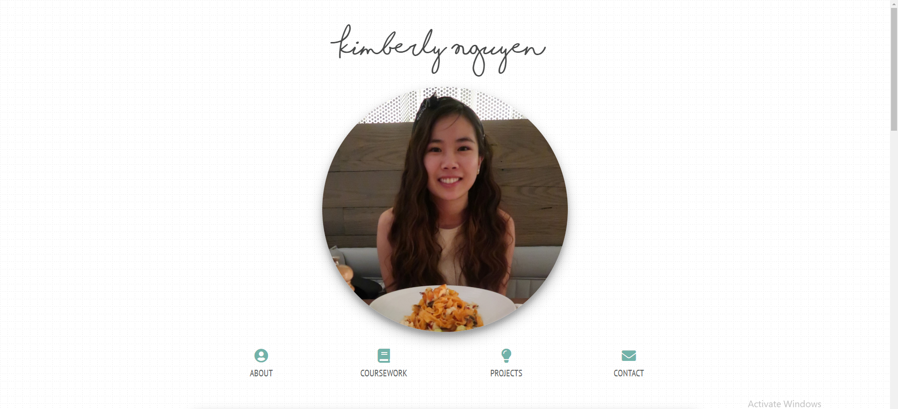
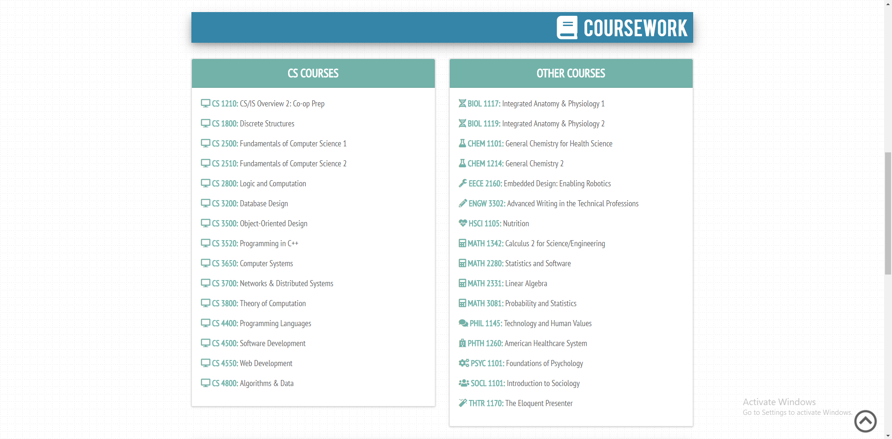
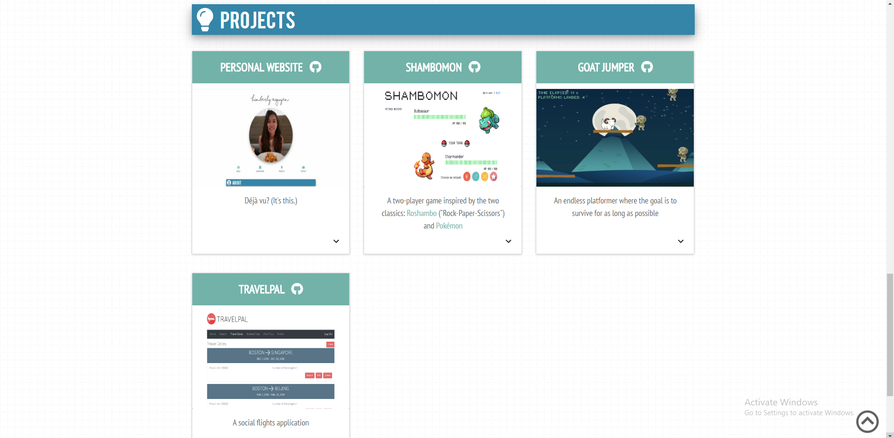
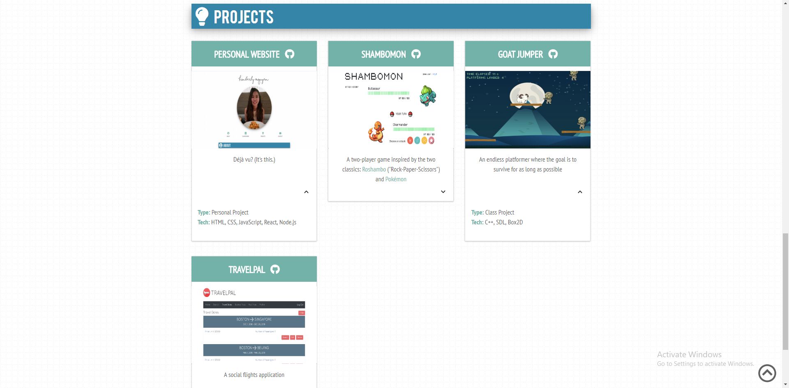

# PersonalWebsite

My website can be visited at https://kimberlypn.herokuapp.com/.

## Introduction
I built this website using React and deployed it using Heroku. This was my
second attempt at building a personal website. My [first attempt](https://github.com/kimberlypn/kimberlypn.github.io)
was in 2016, which was quite early in my computer science career. At the time,
I only knew the barebones of HTML and CSS.

After graduating, I decided to try again using my newfound knowledge. I had
taken Web Development as my capstone and was excited to revamp my personal
website. I had also always wanted to learn how to deploy using Heroku, so that
was a skill that I added to my toolbelt in this process.

## Design

